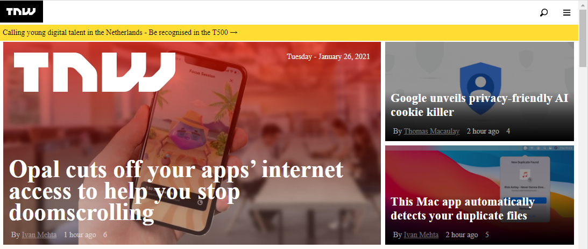

# Building with Responsive Design

> A clone of [TNW](https://perma.cc/M5ZV-Q2D6). Project implemented to demostrate mastery of responsive web design.

Additional description about the project and its features.

## Built With

- HTML
- CSS
- Javascript

## Live Demo

[Live Demo Link](https://chasscepts.github.io/tnw-clone/)

## Authors

👤 **Obetta Francis**

- GitHub: [@chasscepts](https://github.com/chasscepts)
- Twitter: [@ofChass](https://twitter.com/ofChass)
- LinkedIn: [LinkedIn](https://www.linkedin.com/in/francis-obetta-4033b71bb/)

## Author2

👤 **Samrood Ali**

- GitHub: [@samroodAli](https://github.com/SamroodAli)
- LinkedIn: [LinkedIn](https://www.linkedin.com/in/samrood-ali/)
- Twitter: [@ali_samrood](https://twitter.com/ali_samrood)

## Author3

👤 **Olaoluwa Soladoye**

- GitHub: [@crappypapa](https://github.com/crappypapa)
- LinkedIn: [LinkedIn](https://www.linkedin.com/in/olaoluwa-soladoye/)

## 🤝 Contributing

Contributions, issues, and feature requests are welcome!

Feel free to check the [issues page](https://github.com/chasscepts/project-sneak-peak/issues).

## Show your support

Give a ⭐️ if you like this project!

## Acknowledgments

- This project makes heavy use of open source softwares
- The Microverse Community

## 📝 License

This project is [MIT](lic.url) licensed.
